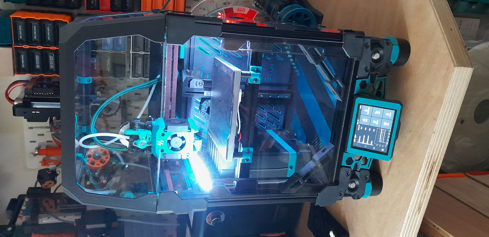

# V0.4156

> [!WARNING]
> This repository is still under development and will probably not be modified for some time :cry:, so take it as it is. The published CAD file (incomplete) is the functional version on my own printer.    

## Mods and useful config for Trizero.

This printer has never been a stock build. The base componenent are listed below (not a complete BOM).
As particularity, it only uses 3 MGN7 rails in Z.
I took me almost 2 year to tinker around this printer.

| hardware                           | vendor                  | Qty |
|------------------------------------|-------------------------|-----|
| V0.1 frame kit                     | LDO                     | 1   |
| V0.2 100W bed + PSU Kit            | LDO                     | 1   |
| G2Z kit                            | LDO                     | 3   |
| 2.8" DSI dipslay + 50cm flat cable | WaveShare               | 1   |
| LDO Leviathan 1.2                  | LDO                     | 1   |
| ESP32-C3                           | generic                 | 1   |
| ACM panel 3mm (deck)               |                         |     |
| AMA panel 3mm                      | onlineplasticsgroup.com |     |
| ASA CF                             | extrudr                 |     |
| ASA (accent) Makita blue           | 3Do                     |     |

# Main mods
- Tri belted G2Z , (only 3 rails)
- [Little Big Filter](./mods/little_big_filter/)
- [TH carriage](./mods/YA_MGN9C_carriage/)
- [printed tophat for 3mm panels](./mods/printed_tophat) Tribute to old style V0
- [backplate + leviathan mount](./mods/trizero_backplate/README.md)
- [power inlet + Shelly mini](./mods/power_inlet/README.md)
- [Tiny peekAboo]()
- [PUG plate cable mount]()
- ...

# Config

It runs "in development" version of [Klippain-Chocolate](https://github.com/elpopo-eng/klippain-chocolate/tree/develop) under [Kalico](https://docs.kalico.gg/).

- Kbobine
- Adaptive heatsoak
- buildplate presets
- fan_savior
- wled commands through Moonraker
