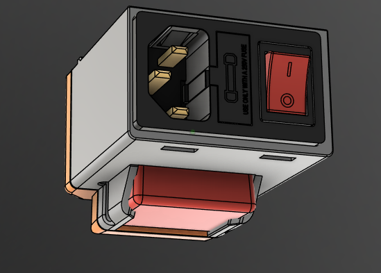

# Automatically Power Off Printer After Pi Shutdown (Not Reboot)

## Why Automate Power-Off?

A proper shutdown sequence for single-board computers (SBCs) like the Raspberry Pi or CB1 is essential to maintain system integrity and extend SD card lifespan. The recommended process is to:

1. Shut down the SBC gracefully.
2. Wait for the device to fully power off.
3. Switch off the power outlet.

This configuration automates the procedure as follows:

- Notifies Home Assistant when a shutdown is initiated.
- Home Assistant monitors the printer’s IP address and waits until it becomes unreachable (up to 4 minutes).
- After an additional 20 seconds, Home Assistant turns off the associated IoT power device.

This method is not perfect or optimal, but it works in my home setup. All printers are powered by Shelly 1PM/2PM devices running Tasmota firmware, and require Home Assistant.

## IoT Device Configuration



I use the [Shelly Mini 1PM](https://www.shelly.com/fr/products/shelly-1pm-mini-gen3), which is compact and easy to integrate into CAD designs. It supports up to 8A / 2000W.

For firmware, I recommend [Tasmota](https://staars.github.io/docs/) for its LAN-only mode (no cloud) and flexible configuration options.

### Tasmota Console Setup

Configure the following in the Tasmota console for printer use:

- **Power On After Energy Recovery:**
  ```
  Rule1 ON Power1#boot DO POWER1 1 ENDON
  ```

- **Switch Only Turns On** (if using a physical switch):
  ```
  SwitchMode1 13
  ```


## Home Assistant Setup

### Requirements

- Printer must have a fixed IP address and be reachable via ping.

### Create an Automation

Go to **Settings > Automations** and create a new automation. Replace values in `<...>` with your own.

```yaml
alias: Turn Off <YOUR_PRINTER_NAME>
description: ""
trigger:
  - platform: webhook
    webhook_id: turnoff_<webhook_token>
    allowed_methods:
      - POST
      - PUT
    local_only: true
condition:
  - condition: template
    value_template: "{{ is_state('binary_sensor.<PRINTER_IP>', 'on') }}"
action:
  - wait_for_trigger:
      - platform: template
        value_template: "{{ is_state('binary_sensor.<PRINTER_IP>', 'off') }}"
        for:
          seconds: 20
    timeout:
      minutes: 4
    continue_on_timeout: false
  - service: switch.turn_off
    target:
      entity_id: switch.<YOUR_IOT_DEVICE>
mode: restart
```

### Create the Ping Tracker

In **Settings > Devices & Services**, add the Ping (ICMP) integration and enter `<PRINTER_IP>`. Hostnames may work, but IP is more reliable.

### Lovelace Card Example

To prevent accidental shutdowns, use [restriction-card](https://github.com/iantrich/restriction-card) in Lovelace. The printer cannot be turned off while the Pi is reachable.

```yaml
- type: entities
  entities:
    - card:
        entity: switch.<tasmota_x>
        name: Printer Name
        icon: mdi:printer-3d
        state_color: true
      restrictions:
        block:
          condition:
            entity: binary_sensor.192_168_<XXXX>_<XXX>
            operator: '=='
            value: 'on'
      type: custom:restriction-card
      row: true
```

## SBC Configuration

Create `/etc/systemd/system/00-poweroff.service` with the following content:

> [!NOTE]
> The service name starts with `00` to ensure it runs first.

```ini
[Unit]
Description=Send Home Assistant Webhook on shutdown
DefaultDependencies=no
Before=shutdown.target
Conflicts=reboot.target

[Service]
Type=oneshot
ExecStart=/usr/bin/curl -X POST http://<HOME_ASSISTANT>:8123/api/webhook/turnoff_<webhook_token>
RemainAfterExit=yes
KillMode=control-group

[Install]
WantedBy=halt.target poweroff.target
```

Enable the service:

```sh
sudo systemctl enable 00-poweroff.service
```
Reboot your SBC to ensure the service is taken into account.

## Troubleshooting

If the automation does not work as expected, follow these steps:

1. **Check Service Logs**  
  Run the following command to view logs and verify if the shutdown service was triggered:
  ```sh
  journalctl -u 00-poweroff.service
  ```

2. **Test Shutdown Sequence**  
  Perform a shutdown of your SBC and observe in Home Assistant if the automation is executed and the IoT device powers off.

3. **Verify Webhook Configuration**  
  Ensure the webhook URL and token in the systemd service match those configured in your Home Assistant automation.

4. **Network Connectivity**  
  Confirm that your SBC and Home Assistant are on the same network and can communicate.

5. **Ping Integration**  
  Make sure the Ping (ICMP) integration is correctly set up and reliably detects the printer’s status.

6. **Home Assistant Logs**  
  Check Home Assistant logs for any errors related to the automation or webhook triggers.

If issues persist, review each configuration step and consult the documentation for your SBC, Tasmota device, and Home Assistant.

