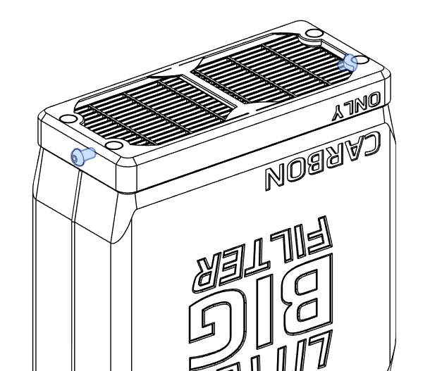

# LITTLE BIG FILTER 
A 0.5L filter for V0 like printers.

## Bill of Materials

| Hardware                                                                     | Qty | Notes                                                                |
|------------------------------------------------------------------------------|-----|----------------------------------------------------------------------|
| 5015 bual Ball bearing Blower or EMB PAPST RLF38-8/14N for the gucci version | 2   |
| HEPA filter - 45x105mm                                                       | 1   | From vaccum cleaner Lefant M200 M201 M520M M571 T700, OKP Life K7 K2 |
| M3x6 BHCS                                                                    | 2   |
| M3x25 BHCS                                                                   | 4   |
| 6x3 Round Neodym magnet                                                      | 8   |

## Assembly
- install the fan in plenum (`blower5015_case.stl`or`RLF35_case.stl`)

The cable can be routed from left or right side depending the place you choose for the filter.

- install magnets on cover (`blower5015_cover.stl`or`RLF35_cover.stl`). Colors represent magnet polarity, invert as shown to make cartridge reversible 

- attach front feet with 2  M3x25 BHCS screws.

- Fix the plenum to the printer extrusion .
> [!TIPS] 
> No preloaded nuts? I use modified M3 squarenuts DIN562 like [LDO Dropin nuts](https://www.youtube.com/watch?v=l7EtO3c_hXk) . Unfortunaltly it works only with LDO style extrusion, not makerbeam extrusion.

- install Grid (`carbononly_grid.stl`) in lid (`carbonlonly_lig.stl`) or HEPA Filter in lid (`hepa_lid.stl`)

- insert magnets in LID. Colors represent magnt polarity, invert on each side 

- fill the cartridge with carbon pellets, cover with the LID, secrure with 2 M3x6 BHCS screws (`carbon_container.stl`)

## Aknowledgments

All Voron community . More to come
