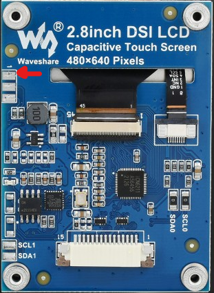
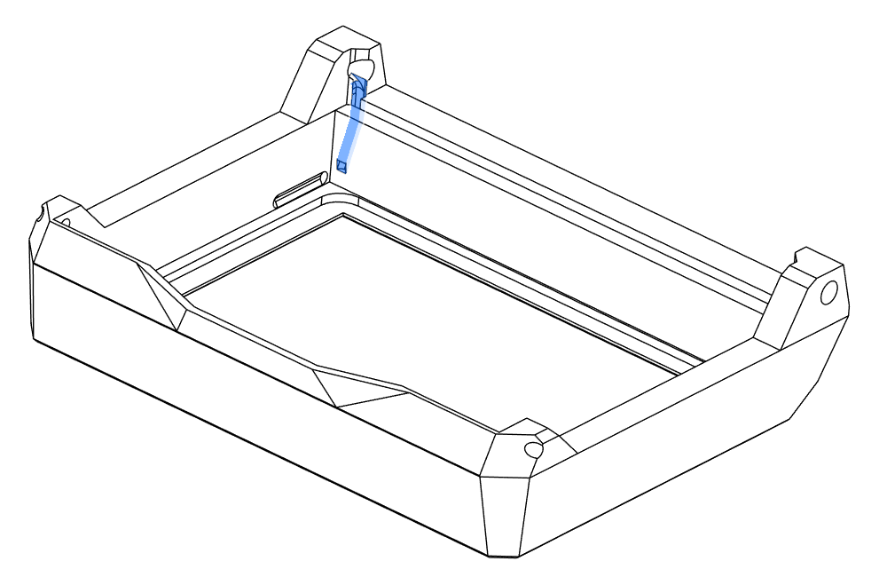

# tiny Peek-A-Boo
A 2.8" retractable display for T0
  
This design fits my T0 with own G2Z mount. 

# Bill of materials

| Hardware                        | Qty | Notes |
| ------------------------------- | --- | ----- |
| Waveshare 2.8" DSI LCD          | 1   | [Waveshare](https://www.waveshare.com/2.8inch-DSI-LCD.htm)
| DSI flat cable                  | 1   | length depends on Pi location (50cm on my T0)
| M3x8 SHCS                       | 4   |
| M2 square nuts                  | 2   | DIN562
| 6x3 N52 magnet                  | 4   |
| D3x20mm shaft                   | 2   |
| ziptie 3mm                      | 2   |  optionial
| 28AWG FEP wire                  | 1   |  2 wires, 1 same length as flat cable, the other about 6cm (not red or black as it's a signal)

# Preparing display (optional)

In order to control backlight, a 6cm 28AWG wire must be solder on Waveshare 2.8" GND pad. 

The other extremity of the wire should be connect to the side shaft through the small hole in the bezel_top 

The other wire connects the front right magnet to the Raspberry Pi

See [Klipperscreen_backlight](./Klipperscreen_backlight/README.md) for software controller